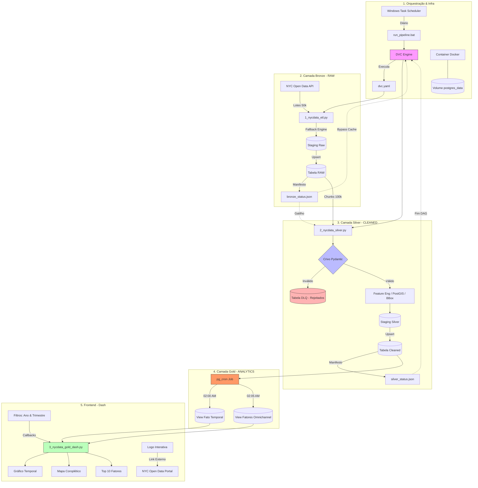

# PROJETO DE ENGENHARIA E VISUALIZAÇÃO DE DADOS - NYC OPEN DATA VEHICLES COLLISIONS

## PROJETO BÁSICO E RESUMO EXECUTIVO
- O fluxo de dados deste projeto foi planejado e executado de acordo com a **Arquitetura Medallion (Bronze ➡️ Silver ➡️ Gold)** de forma desacoplada e orientada a banco de dados (*database-driven*). 
- Em vez de trafegar arquivos pesados, o fluxo utiliza **Manifestos de Estado (State Tokens)** em formato JSON para que o **DVC (Data Version Control)** orquestre os scripts.
- O ciclo completo de funcionamento ocorre em **4 etapas sequenciais** detalhadas nesta documentação.

---

## PADRÕES E PRÁTICAS DE ENGENHARIA DE SOFTWARE

Este projeto foi construído seguindo princípios formais de Engenharia de Software e Padrões de Design (*Design Patterns*) documentados na literatura técnica:

### 1. Separation of Concerns - SoC (Edsger W. Dijkstra)
O sistema é estritamente dividido em componentes com responsabilidades singulares e desacopladas, minimizando o acoplamento e facilitando a manutenibilidade:
- **Ingestão (Bronze):** O script `1_nycdata_etl.py` é o responsável por extrair dados brutos da API e realizar carga raw persistente.
- **Higienização & Validação (Silver):** O script `2_nycdata_silver.py` aplica transformações, parseia fusos horários e valida a qualidade dos dados.
- **Visualização & UI (Gold):** A apresentação é composta por views materializadas `nyc_vehicle_collisions_gold_fact_contribuiting_factors` e `nyc_vehicle_collisions_gold_fact_temporal` que minimizam o custo de processamento, pelo dashboard `3_nycdata_gold_dash.py` e `landpage` os quais exibem dados consolidados.

### 2. Data Contract Pattern (Martin Fowler)
A validação e conformação estrutural dos dados na transição da camada Bronze para a Silver é governada por um **Contrato de Dados** explícito em `schemas.py` implementado via **Pydantic** (`CollisionSilverSchema`). Isso garante que desvios de esquema na API pública (como tipos inválidos ou registros corrompidos) sejam interceptados antes de atingir a base de dados de produção limpa.

### 3. Dead Letter Queue - DLQ (*Enterprise Integration Patterns*)
De acordo com as boas práticas de tratamento de falhas em fluxos de dados, registros que violam o contrato de dados (Pydantic) não quebram o pipeline nem são deletados. Em vez disso, são redirecionados para uma tabela no banco de dados como uma **Dead Letter Queue (DLQ)** (`nycdata_vehicle_collisions_rejections`), preservando o erro técnico para auditorias futuras.

### 4. Fallback & Policy Pattern (*Padrões de Resiliência*)
O script de ingestão implementa uma política de resiliência, ou seja, durante o processamento de CSVs volumosos, tenta-se utilizar o motor de alta performance **PyArrow**, contudo, se o parser falhar por aspas malformadas ou quebras de linha corrompidas na origem, o bloco intercepta a exceção e aciona um motor alternativo em Python com a diretiva `on_bad_lines='skip'`.

### 5. Idempotency & Idempotent Receiver (*Enterprise Integration Patterns*)
Tanto a camada Bronze quanto a Silver implementam o padrão de **Receptor Idempotente**. A gravação final utiliza tabelas de transição temporárias (*Staging Tables*) combinadas com queries de inserção/atualização atômica (**Upsert**) via cláusulas `ON CONFLICT (collision_id) DO NOTHING` (Bronze) e `DO UPDATE` (Silver). Isso garante que execuções repetidas ou parciais do pipeline não dupliquem chaves nem corrompam o estado do banco.

### 6. State Token / Manifesto Pattern (Arquitetura de Sistemas Distribuídos)
Como o DVC (Data Version Control) é uma ferramenta baseada em arquivos e não visualiza modificações internas em bancos de dados relacionais, o pipeline resolve esta barreira gerando pequenos arquivos *"manifestos de estado"* em formato JSON (`bronze_status.json` e `silver_status.json`). Estes manifestos atuam como **Tokens de Estado**, servindo de gatilho e cache lógico para a DAG do DVC orquestrar os estágios.

### 7. Query Pushdown (Database Integration Patterns)
Para otimizar o consumo de recursos computacionais, o projeto delega o processamento analítico pesado (agrupamentos temporais, uniões de fatores causais) diretamente para o motor relacional PostgreSQL por meio de **Views Materializadas** na camada Gold, poupando a memória RAM da aplicação web e do Pandas em tempo de execução.

### 8. Servidor WSGI Corporativo (Waitress)
O dashboard é executado com o **Waitress**, um servidor WSGI multi-threaded de alta concorrência para sistemas de produção Windows. Ele elimina o uso do servidor de desenvolvimento Flask nativo (monothread), sendo capaz de gerenciar múltiplos requests simultâneos com estabilidade.

### 9. Caching de Callbacks (Flask-Caching)
Para minimizar queries repetitivas e reduzir a carga do banco de dados, o dashboard integra o **Flask-Caching** utilizando o sistema de arquivos local (`FileSystemCache`). Filtros idênticos selecionados por diferentes usuários são carregados instantaneamente da memória/disco sem acionar novos acessos ao PostgreSQL.

### 10. Robust Connection Pooling (SQLAlchemy)
A conexão com o banco de dados PostgreSQL utiliza um pool otimizado no SQLAlchemy que reutiliza conexões abertas (`pool_size=20`, `max_overflow=30`, `pool_recycle=1800`), prevenindo erros de exaustão de conexões sob cargas simultâneas de até 200 usuários ativos.

### 11. Logging Estruturado e Centralizado
Substituímos chamadas genéricas de `print` pelo módulo padrão `logging` do Python em todos os scripts do pipeline (`1_nycdata_etl.py`, `2_nycdata_silver.py`, `3_nycdata_gold_dash.py`). Todas as atividades, avisos de qualidade de dados e erros são salvos de forma consolidada no arquivo físico `NYCdata/metadata/pipeline.log`.

---

## O PIPELINE MEDALLION: ETAPAS SEQUENCIAIS

### Passo 1: O Disparo Automático (Orquestração do Windows)
1. O **Agendador de Tarefas do Windows** inicia o workflow conforme programado.
2. Executa o arquivo de lote **`NYCdata/run_pipeline.bat`**.
3. Este arquivo ativa o ambiente virtual (`venv`) e dispara o comando **`dvc repro`**. O DVC assume o controle e lê o arquivo **`dvc.yaml`** para entender quais scripts deve rodar.

### Passo 2: Camada Bronze – Ingestão Incremental
1. O DVC inicia o estágio `ingest_bronze` e executa o script **`1_nycdata_etl.py`** (forçado pela diretiva `always_changed: true`).
2. O script faz uma chamada incremental na API Web do *NYC Open Data*, baixa os novos registros de acidentes e faz o *Upsert* (inserção/atualização) diretamente na tabela bruta do banco: **`nycdata_vehicle_collisions_raw`** no Postgres.
3. Ao finalizar com sucesso, o script cria/atualiza o arquivo **`NYCdata/metadata/bronze_status.json`**, gravando ali a data e hora exata do término da carga.
4. O DVC registra/grava esse JSON. Quando o arquivo muda, o DVC entende que a tabela Bronze ganhou dados novos e autoriza o avanço do pipeline.

### Passo 3: Camada Silver – Limpeza e Contrato de Dados
1. O DVC detecta que a dependência da Silver (`bronze_status.json`) foi alterada e engata automaticamente o estágio `transform_silver`, executando o script **`2_nycdata_silver.py`**.
2. O script lê as regras de mapeamento e validação contidas no arquivo **`NYCdata/scripts/schemas.py`**.
3. O código Python puxa os dados da tabela Bronze do Postgres para a memória, aplica limpeza (conversão de fusos horários para UTC, extração de colunas analíticas e padronização de textos) e submete as linhas ao contrato de dados do **Pydantic**.
    * **Dados Sujos:** São isolados e despejados na tabela de rejeições **`nycdata_vehicle_collisions_rejections` (DLQ)**.
    * **Dados Limpos:** Sofrem um *Upsert* atômico na tabela definitiva **`nycdata_vehicle_collisions_cleaned`** e os índices espaciais (PostGIS GiST) são reconstruídos.
4. No final, o script gera o arquivo **`NYCdata/metadata/silver_status.json`**, salvando as métricas de qualidade (quantas linhas passaram e quantas foram para a DLQ). O DVC encerra o pipeline salvando essas métricas no seu histórico de governança.

### Passo 4: Camada Gold – Visualizações de Dados e Dashboard
1. O pipeline de dados controlado pelo Windows/DVC é encerrado com sucesso na camada Silver. Como o contrato de dados do **Pydantic** garante a qualidade dos registros, a camada Gold recebe uma massa de dados íntegra. A partir deste ponto, a inteligência de processamento é totalmente delegada ao motor interno do **PostgreSQL** através do conceito de *Query Pushdown*.
2. Diariamente a extensão **`pg_cron`** (orquestradora de tarefas nativa do banco) é ativada assíncronamente e independentemente do sistema operacional do host (Windows), disparando atualização das Views Materializadas que foram produzidas na camada Gold:
    * **Às 02:00 AM (`refresh_gold_temporal`):** Atualização da View Materializada `public.nycdata_vehicles_collisions_gold_fact_temporal`, compactando a temporalidade dos dados ao nível de ano e mês truncado por distrito (*borough*), isolando as métricas de severidade: colisões (`total_collisions`), feridos (`total_injured`), mortos (`total_fatalities`) e o volume geral de vítimas físicas (`people_involved`).
    * **Às 02:05 AM (`refresh_gold_factors`):** Atualiza a View Materializada `public.nycdata_vehicles_collisions_gold_fact_contributing_factors`. Esta estrutura implementa o `UNION ALL` das 5 colunas de fatores contribuintes dos acidentes (`vehicle_1` a `vehicle_5`) registradas pela NYPD, indexando nativamente as colunas numéricas de `year` e `month` e removendo ruídos (`'UNSPECIFIED'`, `'UNKNOWN'`).

---

## RESULTADOS E APRESENTAÇÃO (LANDING PAGE & DASHBOARD)

- **Apresentação do Portfólio (Landing Page):** A pasta `landing/` contém uma interface web moderna de apresentação desenvolvida em HTML/CSS/JS puros, que atua como vitrine do portfólio de engenharia de dados. A Landpage detalha a arquitetura, apresenta as tecnologias utilizadas e exibe estatísticas resumidas.
- **Dashboard Reativo (Dash/Plotly):** Com a consolidação das materialized views na camada Gold, o script **`3_nycdata_gold_dash.py`** assume o papel de front-end analítico do projeto, conectando-se diretamente ao Postgres/PostGIS. Ele opera de forma segura e paralela sob o servidor WSGI corporativo **Waitress**.
- **Performance via Pushdown & Caching:** Ao interagir com os seletores, o Dash não realiza varreduras pesadas nas tabelas transacionais (Bronze ou Silver) e não consome memória RAM desnecessária. A lógica reativa (callbacks) faz o *Query Pushdown* direto para as Materialized Views Gold do Postgres. Adicionalmente, consultas repetidas de filtros idênticos são servidas diretamente do **Flask-Caching**, garantindo respostas em sub-milissegundos.
- **Dupla Leitura Temporal:** O gráfico de evolução temporal plota simultaneamente uma linha de volatilidade mês a mês e uma linha de tendência de longo prazo (Média Móvel de 12 meses). Ao selecionar um trimestre específico (ex: 1º Trimestre), o banco retorna exatamente 3 coordenadas (Janeiro, Fevereiro e Março), renderizando no gráfico.

---

## ESTRUTURA DO PROJETO

```
GeoDev/
├── .dvc/                          # Metadados e cache do DVC para versionamento de dados e pipeline
├── .dvcignore                     # Arquivos ignorados pelo DVC durante o versionamento
├── .gitignore                     # Arquivos ignorados pelo Git no repositório
├── dvc.lock                       # Estado travado das etapas do pipeline DVC e hashes de saída
├── dvc.yaml                       # Definição das etapas do pipeline, entradas e saídas do DVC
├── etapas.md                      # Documento de etapas do projeto, planejamento e notas de execução
├── landing/                       # Página de apresentação/portfólio do projeto (Landing Page)
│   ├── assets/                    # Recursos de imagem e screenshot do dashboard
│   │   └── images/
│   │       └── dashboard-screenshot.png
│   ├── css/
│   │   └── styles.css             # Estilos customizados da Landing Page
│   ├── js/
│   │   └── main.js                # Lógica e animações da Landing Page
│   └── index.html                 # Página principal da Landing Page
├── NYCdata/                       # Subprojeto principal contendo scripts, dados e configurações específicas
│   ├── .env                       # Variáveis de ambiente para execução local e configuração de conexões
│   ├── MVCollisionsDataDictionary_20190813_ERD.xlsx # Dicionário de dados e modelo ER do dataset original
│   ├── NYCdata_MotorVehicleCollisions.ipynb # Notebook de análise e protótipo exploratório dos dados NYC
│   ├── README.md                  # Documentação detalhada e técnica específica do subprojeto NYCdata
│   ├── docker-compose.yml         # Configuração de serviços Docker necessários para o ambiente de dados
│   ├── querys.txt                 # Definições de tabelas, índices e views materializadas no Postgres
│   ├── run_pipeline.bat           # Script de lote que ativa o ambiente e dispara o pipeline DVC
│   ├── assets/                    # Imagens e recursos do dashboard Dash
│   ├── data/                      # Dados de entrada e geojson locais
│   │   ├── bronze_raw/            # Armazenamento local dos dados brutos ingeridos incrementalmente
│   │   └── geojson/               # Arquivo geográfico nyc_borough.geojson para mapas coropléticos
│   ├── metadata/                  # Metadados de controle de execução e status das camadas do pipeline
│   │   ├── bronze_status.json     # Relatório de status da camada Bronze gerado após ingestão
│   │   └── silver_status.json     # Relatório de status da camada Silver com métricas de qualidade
│   └── scripts/                   # Código-fonte principal do pipeline e dos contratos de dados
│       ├── 1_nycdata_etl.py       # Script de Ingestão incremental para a camada Bronze
│       ├── 2_nycdata_silver.py    # Script de transformação e limpeza da camada Silver
│       ├── 3_nycdata_gold_dash.py # Dashboard interativo em Dash/Plotly (visualização reativa da camada Gold)
│       ├── 4_nycdata_dash_proto.py# Protótipo inicial do dashboard
│       ├── __pycache__/           # Cache de bytecode Python gerado automaticamente
│       └── schemas.py             # Definições de contrato de dados e validação com Pydantic
├── posts.md                       # Documento de posts, publicações ou anotações do projeto
├── README.md                      # Documentação geral do projeto (este arquivo)
├── requirements.txt               # Lista de dependências Python necessárias para o projeto
└── venv/                          # Ambiente virtual Python local usado para execução
```

---

## FLOWCHART DO PROJETO

