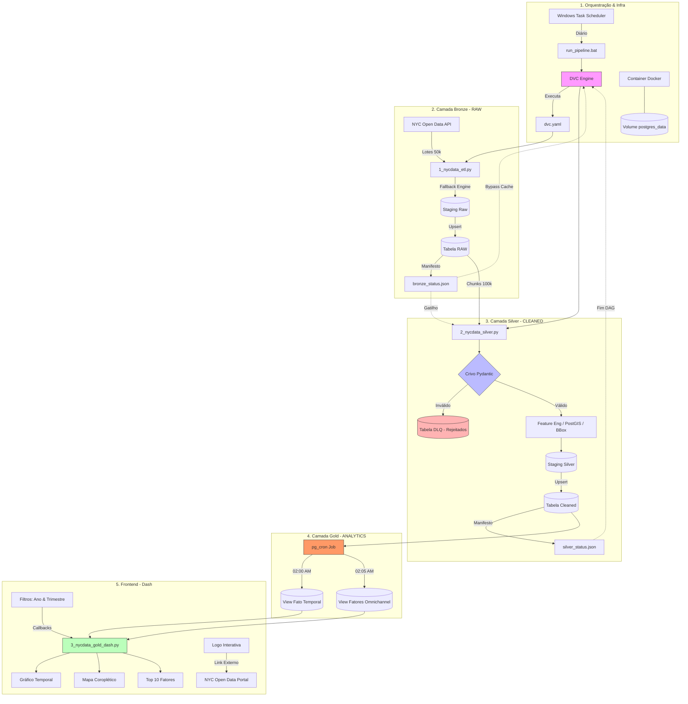

# PROJETO DE ENGENHARIA E VISUALIZAÇÃO DE DADOS - NYC OPEN DATA VEHICLES COLLISIONS

## PROJETO BÁSICO E RESUMO EXECUTIVO
- O fluxo de dados deste projeto foi planejado e executado de acordo com **Arquitetura Medallion (Bronze ➡️ Silver ➡️ Gold)** de forma desacoplada e orientada a banco de dados (*database-driven*). 
- Em vez de trafegar arquivos pesados, o fluxo utiliza **Manifestos de Estado (State Tokens)** em formato JSON para que o **DVC (Data Version Control)** orquestre os scripts.
- O ciclo completo de funcionamento ocorre em **4 etapas sequenciais**:

## Passo 1: O Disparo Automático (Orquestração do Windows)

1. O **Agendador de Tarefas do Windows** inicia o workflow conforme programado.
2. Executa o arquivo de lote **`NYCdata/run_pipeline.bat`**.
3. Este arquivo ativa o ambiente virtual (`venv`) e dispara o comando **`dvc repro`**. O DVC assume o controle e lê o arquivo **`dvc.yaml`** para entender quais scripts deve rodar.

## Passo 2: Camada Bronze – Ingestão Incremental

1. O DVC inicia o estágio `ingest_bronze` e executa o script **`1_nycdata_etl.py`** (forçado pela diretiva `always_changed: true`).
2. O script faz uma chamada incremental na API Web do *NYC Open Data*, baixa os novos registros de acidentes e faz o *Upsert* (inserção/atualização) diretamente na tabela bruta do banco: **`nycdata_vehicle_collisions_raw`** no Postgres.
3. Ao finalizar com sucesso, o script cria/atualiza o arquivo **`NYCdata/metadata/bronze_status.json`**, gravando ali a data e hora exata do término da carga.
4. O DVC registra/grava esse JSON. Quando o arquivo muda, o DVC entende que a tabela Bronze ganhou dados novos e autoriza o avanço do pipeline.

## Passo 3: Camada Silver – Limpeza e Contrato de Dados

1. O DVC detecta que a dependência da Silver (`bronze_status.json`) foi alterada e engata automaticamente o estágio `transform_silver`, executando o script **`2_nycdata_silver.py`**.
2. O script lê as regras de mapeamento e validação contidas no arquivo **`NYCdata/scripts/schemas.py`**.
3. O código Python puxa os dados da tabela Bronze do Postgres para a memória, aplica limpeza (conversão de fusos horários para UTC, extração de colunas analíticas e padronização de textos) e submete as linhas ao contrato de dados do **Pydantic**.
    * **Dados Sujos:** São isolados e despejados na tabela de rejeições **`nycdata_vehicle_collisions_rejections` (DLQ)**.
    * **Dados Limpos:** Sofrem um *Upsert* atômico na tabela definitiva **`nycdata_vehicle_collisions_cleaned`** e os índices espaciais (PostGIS GiST) são reconstruídos.
4. No final, o script gera o arquivo **`NYCdata/metadata/silver_status.json`**, salvando as métricas de qualidade (quantas linhas passaram e quantas foram para a DLQ). O DVC encerra o pipeline salvando essas métricas no seu histórico de governança.

## Passo 4: Camada Gold – Visualizações de Dados e Dashboard

1. O pipeline de dados controlado pelo Windows/DVC é encerrado com sucesso na camada Silver. Como o contrato de dados do **Pydantic** garante a qualidade dos registros, a camada Gold recebe uma massa de dados íntegra. A partir deste ponto, a inteligência de processamento é totalmente delegada ao motor interno do **PostgreSQL** através do conceito de *Query Pushdown*.
2. Diariamente a extensão **`pg_cron`** (orquestradora de tarefas nativa do banco) é ativada assíncronamente e independentemente do sistema operacional do host (Windows), disparando atualização das Views Materializadas que foram produzidas na camada Gold:
    * **Às 02:00 AM (`refresh_gold_temporal`):** Atualização da View Materializada `public.nycdata_vehicles_collisions_gold_fact_temporal`, compactando a temporalidade dos dados ao nível de ano e mês truncado por distrito (*borough*), isolando as métricas de severidade: colisões (`total_collisions`), feridos (`total_injured`), mortos (`total_fatalities`) e o volume geral de vítimas físicas (`people_involved`).
    * **Às 02:05 AM (`refresh_gold_factors`):** Atualiza a View Materializada `public.nycdata_vehicles_collisions_gold_fact_contributing_factors`. Esta estrutura implementa o `UNION ALL` das 5 colunas de fatores contribuintes dos acidentes (`vehicle_1` a `vehicle_5`) registradas pela NYPD, indexando nativamente as colunas numéricas de `year` e `month` e removendo ruídos (`'UNSPECIFIED'`, `'UNKNOWN'`).

---

## RESULTADO: DASHBOARD (DASH)

* **Dashboard:** Com a consolidação das materialized views na camada Gold, o script **`3_nycdata_gold_dash.py`** assume o papel de front-end do projeto. 
* **Performance via Pushdown:** Ao interagir com os seletores, o Dash não realiza varreduras pesadas nas tabelas transacionais (Bronze ou Silver) e não consome memória RAM processando loops ou filtros em DataFrames do Pandas. O callback envia queries minimalistas para as Materialized Views Gold. 
* **Dupla Leitura Temporal:** O gráfico de evolução temporal plota simultaneamente uma linha de volatilidade mês a mês e uma linha de tendência de longo prazo (Média Móvel de 12 meses). Ao selecionar um trimestre específico (ex: 1º Trimestre), o banco retorna exatamente 3 coordenadas (Janeiro, Fevereiro e Março).

## FLOWCHART DO PROJETO

