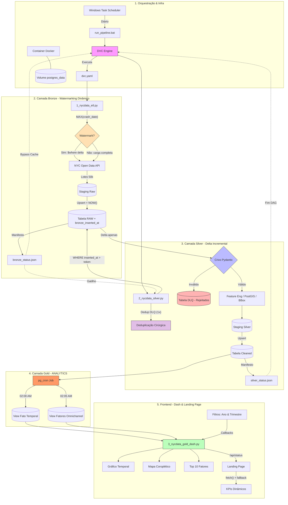

# PROJETO DE ENGENHARIA E VISUALIZAÇÃO DE DADOS - NYC OPEN DATA VEHICLES COLLISIONS

## 🚀 COMO LIGAR O PROJETO

Siga as instruções abaixo de forma sequencial para colocar todos os serviços e componentes do ecossistema em execução:

### 1. Inicializar a Infraestrutura (Banco de Dados)
Certifique-se de que o Docker Desktop está rodando e execute o comando abaixo para iniciar o contêiner do PostgreSQL com PostGIS no diretório principal do subprojeto:
```bash
cd NYCdata
docker-compose up -d
```
*Isso levantará o banco na porta local `5432` mapeado ao volume persistente.*

### 2. Ativar o Ambiente Virtual
No diretório raiz do projeto (`GeoDev/`), ative o ambiente virtual contendo todas as dependências Python necessárias:
- **Windows (PowerShell):**
  ```powershell
  .\venv\Scripts\Activate.ps1
  ```
- **Windows (Prompt de Comando):**
  ```cmd
  .\venv\Scripts\activate.bat
  ```

### 3. Executar o Pipeline DVC (Extração & Processamento)
Para rodar os pipelines de ingestão e qualidade das camadas Bronze e Silver controlados pelo Data Version Control:
```bash
dvc repro
```
*Nota: Se o agendador de tarefas do Windows já estiver configurado, você também pode disparar a execução rodando o arquivo `NYCdata/run_pipeline.bat`.*

### 4. Ligar o Backend do Dashboard (Servidor Flask/Dash)
Inicie o servidor local do dashboard na porta `8050`:
```bash
python NYCdata/scripts/3_nycdata_gold_dash.py
```
*O console exibirá a mensagem de confirmação indicando que o servidor Flask está ativo e servindo a API `/api/status` e a interface gráfica.*

### 5. Acessar o Dashboard

Inicie o navegador e acesse qualquer dos endereços abaixo: 

```bash
http://localhost:8050/

```

```bash
http://127.0.0.1:8050
```

### 6. Abrir a Landing Page (Frontend)
Navegue até o diretório `landing/` e abra o arquivo `index.html` diretamente em seu navegador web (Chrome ou Firefox recomendados), ou utilize a extensão Live Server da sua IDE:
```bash
Start-Process "landing/index.html"
```
*A página conectará dinamicamente ao backend rodando e renderizará a telemetria em tempo real.*

---

## PROJETO BÁSICO E RESUMO EXECUTIVO
- O fluxo de dados deste projeto foi planejado e executado de acordo com a **Arquitetura Medallion (Bronze ➡️ Silver ➡️ Gold)** de forma desacoplada e orientada a banco de dados (*database-driven*). 
- Em vez de trafegar arquivos pesados, o fluxo utiliza **Manifestos de Estado (State Tokens)** em formato JSON para que o **DVC (Data Version Control)** orquestre os scripts.
- O pipeline implementa **Watermarking Dinâmico** para ingestão incremental, evitando reprocessamento histórico e garantindo que apenas dados genuinamente novos sejam processados a cada execução.
- O ciclo completo de funcionamento ocorre em **4 etapas sequenciais** detalhadas nesta documentação.

---

## PADRÕES E PRÁTICAS DE ENGENHARIA DE SOFTWARE

Este projeto foi construído seguindo princípios formais de Engenharia de Software e Padrões de Design (*Design Patterns*) documentados na literatura técnica:

### 1. Separation of Concerns - SoC (Edsger W. Dijkstra)
O sistema é estritamente dividido em componentes com responsabilidades singulares e desacopladas, minimizando o acoplamento e facilitando a manutenibilidade:
- **Ingestão (Bronze):** O script `1_nycdata_etl.py` é o responsável por extrair dados brutos da API e realizar carga raw persistente com watermarking dinâmico.
- **Higienização & Validação (Silver):** O script `2_nycdata_silver.py` aplica transformações, parseia fusos horários e valida a qualidade dos dados, processando apenas o delta incremental.
- **Visualização & UI (Gold):** A apresentação é composta por views materializadas `nyc_vehicle_collisions_gold_fact_contribuiting_factors` e `nyc_vehicle_collisions_gold_fact_temporal` que minimizam o custo de processamento, pelo dashboard `3_nycdata_gold_dash.py` e `landpage` os quais exibem dados consolidados.

### 2. Dynamic Watermarking (Incremental Load Pattern)
O pipeline adota um padrão de **Marca d'Água Dinâmica** para eliminar o reprocessamento histórico:
- **Bronze:** Consulta `SELECT MAX(crash_date)` no Postgres e injeta o valor como filtro `$where` na API SODA, coletando apenas registros posteriores ao watermark.
- **Silver:** Lê do manifesto `silver_status.json` o campo `last_bronze_watermark` e filtra a Bronze com `WHERE bronze_inserted_at > :last_token`, processando apenas o delta.
- **Encerramento Gracioso:** Quando não há dados novos, a Silver encerra em < 5 segundos sem tocar nas tabelas de produção nem na DLQ.

### 3. Data Contract Pattern (Martin Fowler)
A validação e conformação estrutural dos dados na transição da camada Bronze para a Silver é governada por um **Contrato de Dados** explícito em `schemas.py` implementado via **Pydantic** (`CollisionSilverSchema`). Isso garante que desvios de esquema na API pública (como tipos inválidos ou registros corrompidos) sejam interceptados antes de atingir a base de dados de produção limpa.

### 4. Dead Letter Queue - DLQ (*Enterprise Integration Patterns*)
De acordo com as boas práticas de tratamento de falhas em fluxos de dados, registros que violam o contrato de dados (Pydantic) não quebram o pipeline nem são deletados. Em vez disso, são redirecionados para uma tabela no banco de dados como uma **Dead Letter Queue (DLQ)** (`nycdata_vehicle_collisions_rejections`), preservando o erro técnico para auditorias futuras. Com o watermarking dinâmico, a DLQ nunca mais acumula duplicatas históricas, pois apenas rejeições do delta atual são inseridas.

### 5. Fallback & Policy Pattern (*Padrões de Resiliência*)
O script de ingestão implementa uma política de resiliência, ou seja, durante o processamento de CSVs volumosos, tenta-se utilizar o motor de alta performance **PyArrow**, contudo, se o parser falhar por aspas malformadas ou quebras de linha corrompidas na origem, o bloco intercepta a exceção e aciona um motor alternativo em Python com a diretiva `on_bad_lines='skip'`.

### 6. Idempotency & Idempotent Receiver (*Enterprise Integration Patterns*)
Tanto a camada Bronze quanto a Silver implementam o padrão de **Receptor Idempotente**. A gravação final utiliza tabelas de transição temporárias (*Staging Tables*) combinadas com queries de inserção/atualização atômica (**Upsert**) via cláusulas `ON CONFLICT (collision_id) DO NOTHING` (Bronze) e `DO UPDATE` (Silver). Isso garante que execuções repetidas ou parciais do pipeline não dupliquem chaves nem corrompam o estado do banco.

### 7. State Token / Manifesto Pattern (Arquitetura de Sistemas Distribuídos)
Como o DVC (Data Version Control) é uma ferramenta baseada em arquivos e não visualiza modificações internas em bancos de dados relacionais, o pipeline resolve esta barreira gerando pequenos arquivos *"manifestos de estado"* em formato JSON (`bronze_status.json` e `silver_status.json`). Estes manifestos atuam como **Tokens de Estado**, servindo de gatilho e cache lógico para a DAG do DVC orquestrar os estágios. O manifesto Silver agora inclui o campo `last_bronze_watermark` que controla a marca d'água temporal do processamento incremental.

### 8. Query Pushdown (Database Integration Patterns)
Para otimizar o consumo de recursos computacionais, o projeto delega o processamento analítico pesado (agrupamentos temporais, uniões de fatores causais) diretamente para o motor relacional PostgreSQL por meio de **Views Materializadas** na camada Gold, poupando a memória RAM da aplicação web e do Pandas em tempo de execução.

### 9. Servidor WSGI Corporativo (Waitress)
O dashboard é executado com o **Waitress**, um servidor WSGI multi-threaded de alta concorrência para sistemas de produção Windows. Ele elimina o uso do servidor de desenvolvimento Flask nativo (monothread), sendo capaz de gerenciar múltiplos requests simultâneos com estabilidade.

### 10. Caching de Callbacks (Flask-Caching)
Para minimizar queries repetitivas e reduzir a carga do banco de dados, o dashboard integra o **Flask-Caching** utilizando o sistema de arquivos local (`FileSystemCache`). Filtros idênticos selecionados por diferentes usuários são carregados instantaneamente da memória/disco sem acionar novos acessos ao PostgreSQL.

### 11. Robust Connection Pooling (SQLAlchemy)
A conexão com o banco de dados PostgreSQL utiliza um pool otimizado no SQLAlchemy que reutiliza conexões abertas (`pool_size=20`, `max_overflow=30`, `pool_recycle=1800`), prevenindo erros de exaustão de conexões sob cargas simultâneas de até 200 usuários ativos.

### 12. Logging Estruturado e Centralizado
Substituímos chamadas genéricas de `print` pelo módulo padrão `logging` do Python em todos os scripts do pipeline (`1_nycdata_etl.py`, `2_nycdata_silver.py`, `3_nycdata_gold_dash.py`). Todas as atividades, avisos de qualidade de dados e erros são salvos de forma consolidada no arquivo físico `NYCdata/metadata/pipeline.log`.

### 13. Telemetria de Pipeline em Tempo Real
O dashboard Dash expõe uma API leve `/api/status` no servidor Flask subjacente (`app.server`), servindo métricas consolidadas de produção e rejeições em formato JSON com CORS habilitado. A landing page consome essa API via `fetch()` assíncrono, exibindo os KPIs dinâmicos com fallback gracioso para valores estáticos caso o servidor não esteja ativo.

---

## O PIPELINE MEDALLION: ETAPAS SEQUENCIAIS

### Passo 1: O Disparo Automático (Orquestração do Windows)
1. O **Agendador de Tarefas do Windows** inicia o workflow conforme programado.
2. Executa o arquivo de lote **`NYCdata/run_pipeline.bat`**.
3. Este arquivo ativa o ambiente virtual (`venv`) e dispara o comando **`dvc repro`**. O DVC assume o controle e lê o arquivo **`dvc.yaml`** para entender quais scripts deve rodar.

### Passo 2: Camada Bronze – Ingestão com Watermarking Dinâmico
1. O DVC inicia o estágio `ingest_bronze` e executa o script **`1_nycdata_etl.py`** (forçado pela diretiva `always_changed: true`).
2. O script executa a migração de schema idempotente, garantindo a existência da coluna `bronze_inserted_at` na tabela raw.
3. Consulta `SELECT MAX(crash_date)` no Postgres para obter a **marca d'água dinâmica** — a data do acidente mais recente já ingerido.
4. Faz uma chamada **filtrada** na API SODA do *NYC Open Data* usando `$where=crash_date > '{watermark}'`, coletando apenas registros genuinamente novos.
5. Os registros são carregados via staging + *Upsert* (`ON CONFLICT DO NOTHING`) na tabela **`nycdata_vehicle_collisions_raw`**, com a coluna `bronze_inserted_at` recebendo `NOW()` automaticamente.
6. Se não houver dados novos na API, o pipeline encerra rapidamente com `records_ingested: 0`.
7. Ao finalizar, o script gera/atualiza o **`NYCdata/metadata/bronze_status.json`** com o watermark e as métricas da carga.

### Passo 3: Camada Silver – Leitura Incremental, Contrato de Dados e Deduplicação da DLQ
1. O DVC detecta que a dependência da Silver (`bronze_status.json`) foi alterada e engata automaticamente o estágio `transform_silver`, executando o script **`2_nycdata_silver.py`**.
2. Na primeira execução pós-migração, o script executa a **deduplicação cirúrgica da DLQ**, removendo duplicatas históricas acumuladas. Esta operação é protegida pela flag `dlq_deduplicated` no manifesto e nunca se repete.
3. O script lê o campo `last_bronze_watermark` do manifesto `silver_status.json` e filtra a Bronze com `WHERE bronze_inserted_at > :last_token`, processando apenas o **delta incremental**.
4. Se o delta for vazio (0 registros novos), a Silver encerra graciosamente em **< 5 segundos** sem tocar nas tabelas de produção nem na DLQ.
5. Se houver dados novos, o código aplica limpeza (conversão de fusos horários para UTC, extração de colunas analíticas e padronização de textos) e submete as linhas ao contrato de dados do **Pydantic**.
    * **Dados Sujos:** São isolados e despejados na tabela de rejeições **`nycdata_vehicle_collisions_rejections` (DLQ)** via `APPEND`.
    * **Dados Limpos:** Sofrem um *Upsert* atômico na tabela definitiva **`nycdata_vehicle_collisions_cleaned`** e os índices espaciais (PostGIS GiST) são reconstruídos.
6. No final, o script gera o arquivo **`NYCdata/metadata/silver_status.json`**, salvando o novo watermark temporal e as métricas de qualidade do lote. O DVC encerra o pipeline salvando essas métricas no seu histórico de governança.

### Passo 4: Camada Gold – Visualizações de Dados e Dashboard
1. O pipeline de dados controlado pelo Windows/DVC é encerrado com sucesso na camada Silver. Como o contrato de dados do **Pydantic** garante a qualidade dos registros, a camada Gold recebe uma massa de dados íntegra. A partir deste ponto, a inteligência de processamento é totalmente delegada ao motor interno do **PostgreSQL** através do conceito de *Query Pushdown*.
2. Diariamente a extensão **`pg_cron`** (orquestradora de tarefas nativa do banco) é ativada assíncronamente e independentemente do sistema operacional do host (Windows), disparando atualização das Views Materializadas que foram produzidas na camada Gold:
    * **Às 02:00 AM (`refresh_gold_temporal`):** Atualização da View Materializada `public.nycdata_vehicles_collisions_gold_fact_temporal`, compactando a temporalidade dos dados ao nível de ano e mês truncado por distrito (*borough*), isolando as métricas de severidade: colisões (`total_collisions`), feridos (`total_injured`), mortos (`total_fatalities`) e o volume geral de vítimas físicas (`people_involved`).
    * **Às 02:05 AM (`refresh_gold_factors`):** Atualiza a View Materializada `public.nycdata_vehicles_collisions_gold_fact_contributing_factors`. Esta estrutura implementa o `UNION ALL` das 5 colunas de fatores contribuintes dos acidentes (`vehicle_1` a `vehicle_5`) registradas pela NYPD, indexando nativamente as colunas numéricas de `year` e `month` e removendo ruídos (`'UNSPECIFIED'`, `'UNKNOWN'`).

---

## RESULTADOS E APRESENTAÇÃO (LANDING PAGE & DASHBOARD)

- **Apresentação do Portfólio (Landing Page):** A pasta `landing/` contém uma interface web moderna de apresentação desenvolvida em HTML/CSS/JS puros, que atua como vitrine do portfólio de engenharia de dados. A Landpage detalha a arquitetura, apresenta as tecnologias utilizadas e exibe estatísticas resumidas. A seção de KPIs é dividida em **Métricas de Escopo** (estáticas) e **Telemetria de Carga** (dinâmicas, consumidas via API `/api/status` do dashboard).
- **Dashboard Reativo (Dash/Plotly):** Com a consolidação das materialized views na camada Gold, o script **`3_nycdata_gold_dash.py`** assume o papel de front-end analítico do projeto, conectando-se diretamente ao Postgres/PostGIS. Ele opera de forma segura e paralela sob o servidor WSGI corporativo **Waitress**. O dashboard também expõe a rota `/api/status` para telemetria de pipeline consumida pela landing page.
- **Performance via Pushdown & Caching:** Ao interagir com os seletores, o Dash não realiza varreduras pesadas nas tabelas transacionais (Bronze ou Silver) e não consome memória RAM desnecessária. A lógica reativa (callbacks) faz o *Query Pushdown* direto para as Materialized Views Gold do Postgres. Adicionalmente, consultas repetidas de filtros idênticos são servidas diretamente do **Flask-Caching**, garantindo respostas em sub-milissegundos.
- **Dupla Leitura Temporal:** O gráfico de evolução temporal plota simultaneamente uma linha de volatilidade mês a mês e uma linha de tendência de longo prazo (Média Móvel de 12 meses). Ao selecionar um trimestre específico (ex: 1º Trimestre), o banco retorna exatamente 3 coordenadas (Janeiro, Fevereiro e Março), renderizando no gráfico.

---

## ESTRUTURA DO PROJETO

```
GeoDev/
├── .dvc/                          # Metadados e cache do DVC para versionamento de dados e pipeline
├── .dvcignore                     # Arquivos ignorados pelo DVC durante o versionamento
├── .gitignore                     # Arquivos ignorados pelo Git no repositório
├── checkup_env.md                 # Playbook de auditoria e verificação do ecossistema (banco, DVC, cache, etc.)
├── dvc.lock                       # Estado travado das etapas do pipeline DVC e hashes de saída
├── dvc.yaml                       # Definição das etapas do pipeline, entradas e saídas do DVC
├── landing/                       # Página de apresentação/portfólio do projeto (Landing Page)
│   ├── assets/                    # Recursos de imagem e screenshot do dashboard
│   │   └── images/
│   │       └── dashboard-screenshot.png
│   ├── css/
│   │   └── styles.css             # Estilos customizados da Landing Page
│   ├── js/
│   │   └── main.js                # Lógica, animações e consumo da API de telemetria
│   └── index.html                 # Página principal da Landing Page
├── NYCdata/                       # Subprojeto principal contendo scripts, dados e configurações específicas
│   ├── .env                       # Variáveis de ambiente para execução local e configuração de conexões
│   ├── MVCollisionsDataDictionary_20190813_ERD.xlsx # Dicionário de dados e modelo ER do dataset original
│   ├── NYCdata_MotorVehicleCollisions.ipynb # Notebook de análise e protótipo exploratório dos dados NYC
│   ├── README.md                  # Documentação detalhada e técnica específica do subprojeto NYCdata
│   ├── docker-compose.yml         # Configuração de serviços Docker necessários para o ambiente de dados
│   ├── run_pipeline.bat           # Script de lote que ativa o ambiente e dispara o pipeline DVC
│   ├── assets/                    # Imagens e recursos do dashboard Dash
│   │   ├── dashboard_geral.png    # Screenshot geral do dashboard reativo
│   │   └── nyc_opendata.png       # Logomarca do portal NYC Open Data
│   ├── cache/                     # Cache local persistente de callbacks gerado pelo Flask-Caching
│   ├── data/                      # Dados de entrada e geojson locais
│   │   ├── bronze_raw/            # Armazenamento local dos dados brutos ingeridos incrementalmente
│   │   └── geojson/               # Arquivo geográfico nyc_borough.geojson para mapas coropléticos
│   ├── metadata/                  # Metadados de controle de execução e status das camadas do pipeline
│   │   ├── .gitignore             # Arquivos ignorados sob o diretório de metadados
│   │   ├── bronze_status.json     # Manifesto Bronze: status, watermark, contagem da última ingestão
│   │   ├── pipeline.log           # Log consolidado e estruturado de execução de todo o pipeline
│   │   └── silver_status.json     # Manifesto Silver: watermark temporal, métricas de qualidade, flag DLQ
│   └── scripts/                   # Código-fonte principal do pipeline e dos contratos de dados
│       ├── 1_nycdata_etl.py       # Script de Ingestão com Watermarking Dinâmico (camada Bronze)
│       ├── 2_nycdata_silver.py    # Script de transformação incremental e deduplicação DLQ (camada Silver)
│       ├── 3_nycdata_gold_dash.py # Dashboard interativo Dash/Plotly + API /api/status (camada Gold)
│       ├── 4_nycdata_dash_proto.py# Protótipo inicial do dashboard
│       ├── __pycache__/           # Cache de bytecode Python gerado automaticamente
│       └── schemas.py             # Definições de contrato de dados e validação com Pydantic
├── posts.md                       # Documento de posts, publicações ou anotações do projeto
├── README.md                      # Documentação geral do projeto (este arquivo)
├── requirements.txt               # Lista de dependências Python necessárias para o projeto
└── venv/                          # Ambiente virtual Python local usado para execução
```

---

## FLOWCHART DO PROJETO



---

## 📈 MUDANÇAS IMPLEMENTADAS (INTEGRAÇÃO DE TELEMETRIA)

### 1. Backend API REST (`3_nycdata_gold_dash.py`)
- Implementação de um endpoint Flask interno no Dash (`/api/status`) que lê assincronamente os metadados agregados em `bronze_status.json` e `silver_status.json`.
- Adição de configuração CORS nativa via `@app.server.after_request` permitindo que requisições vindas da landing page estática (local ou deployada) acessem o endpoint sem bloqueios de segurança.

### 2. Frontend Dinâmico (`landing/`)
- Criação de uma landing page corporativa responsiva no estilo corporativo Esri/ArcGIS Enterprise.
- Implementação de requisições assíncronas em `landing/js/main.js` consumindo `/api/status`.
- Execução de **Reconciliação Matemática** no lado do cliente (`Total = Aprovados + Rejeitados`), garantindo coerência visual e telemetria blindada contra atrasos de transações.
- Adição de fallback para dados históricos estáticos caso o servidor local esteja offline.

### 3. Atualização de Documentação (`README.md`)
- Inclusão deste guia de inicialização passo a passo e detalhamento de roteiro para testes manuais.

---

## 🧪 ROTEIRO DE VERIFICAÇÃO E TESTES (MANUAL)

Siga este guia estruturado de testes para validar o comportamento fim a fim das quatro principais camadas do sistema:

### Teste 1: Extração e Ingestão de Dados (Camada Bronze)
1. Certifique-se de que a API do NYC Open Data está respondendo.
2. Inicie o pipeline executando o script de ingestão isoladamente:
   ```bash
   python NYCdata/scripts/1_nycdata_etl.py
   ```
3. **O que observar:**
   - O console deve logar o status da extração ("Carga Incremental detectada..." ou "Iniciando carga histórica...").
   - O arquivo [bronze_status.json](file:///c:/Users/HP/Documents/Projetos/GeoDev/NYCdata/metadata/bronze_status.json) deve ser criado ou ter seu timestamp de atualização (`updated_at`) modificado para a data/hora atuais.
   - O volume incremental capturado na API deve ser registrado na propriedade `records_ingested`.

### Teste 2: Armazenamento e Qualidade de Dados (Camada Silver & DLQ)
1. Execute o script de transformação Silver:
   ```bash
   python NYCdata/scripts/2_nycdata_silver.py
   ```
2. Abra seu cliente de banco de dados (ex: DBeaver) e execute as seguintes validações no banco `cron.database_name` (ou mapeado no seu `.env`):
   - **Tabela Cleaned:** Execute `SELECT COUNT(*) FROM nycdata_vehicle_collisions_cleaned;`. O número deve ser idêntico ao total de registros aprovados.
   - **DLQ/Rejeições:** Execute `SELECT COUNT(*) FROM nycdata_vehicle_collisions_rejections;`. Certifique-se de que todas as linhas contêm o log detalhado de erro gerado pelo validador do Pydantic.
   - **Enriquecimento Espacial:** Execute `SELECT ST_AsText(geom) FROM nycdata_vehicle_collisions_cleaned WHERE geom IS NOT NULL LIMIT 5;`. Deve retornar strings espaciais legíveis como `POINT(-73.985 40.748)`.
   - **Validação de Limites (Bounding Box):** Execute `SELECT COUNT(*) FROM nycdata_vehicle_collisions_cleaned WHERE geom IS NULL AND latitude IS NOT NULL;`. O banco deve registrar que as coordenadas fora da Bounding Box de NYC foram forçadas para `NULL`.

### Teste 3: Funcionamento do Backend (Servidor Dash & API REST)
1. Com o banco ativo, execute o backend:
   ```bash
   python NYCdata/scripts/3_nycdata_gold_dash.py
   ```
2. Abra seu navegador e acesse o endereço da API REST: `http://localhost:8050/api/status`.
3. **O que observar:**
   - O navegador deve exibir um objeto JSON estruturado contendo dados válidos:
     `{"total_approved": 2259956, "total_rejected_dlq": 8959, "last_ingest_qty": 0, "last_ingest_date": "...", "watermark_crash_date": "..."}`
   - O console do terminal do Python não deve apresentar erros de I/O de leitura ou erros CORS.

### Teste 4: Funcionamento do Frontend (Landing Page & Telemetria)
1. **Cenário A (Servidor Dash Offline):**
   - Pare o servidor Dash se ele estiver rodando (`Ctrl + C` no terminal).
   - Abra o arquivo `landing/index.html` no seu navegador.
   - **O que observar:** O iframe do dashboard deve exibir uma screenshot estática de fallback do dashboard geral com uma mensagem instrutiva. Os KPIs devem carregar exibindo os valores estáticos de fallback (`2.26M+` records).
2. **Cenário B (Servidor Dash Online):**
   - Inicie o servidor Dash (`python NYCdata/scripts/3_nycdata_gold_dash.py`).
   - Atualize a landing page (`landing/index.html`) no seu navegador.
   - **O que observar:** O iframe deve exibir o dashboard Dash interativo em tela cheia com mapas e gráficos funcionais. Os contadores de KPI no topo da página devem subir dinamicamente com base nos dados puxados da API e a soma de aprovados + rejeitados na DLQ deve se reconciliar perfeitamente na interface.